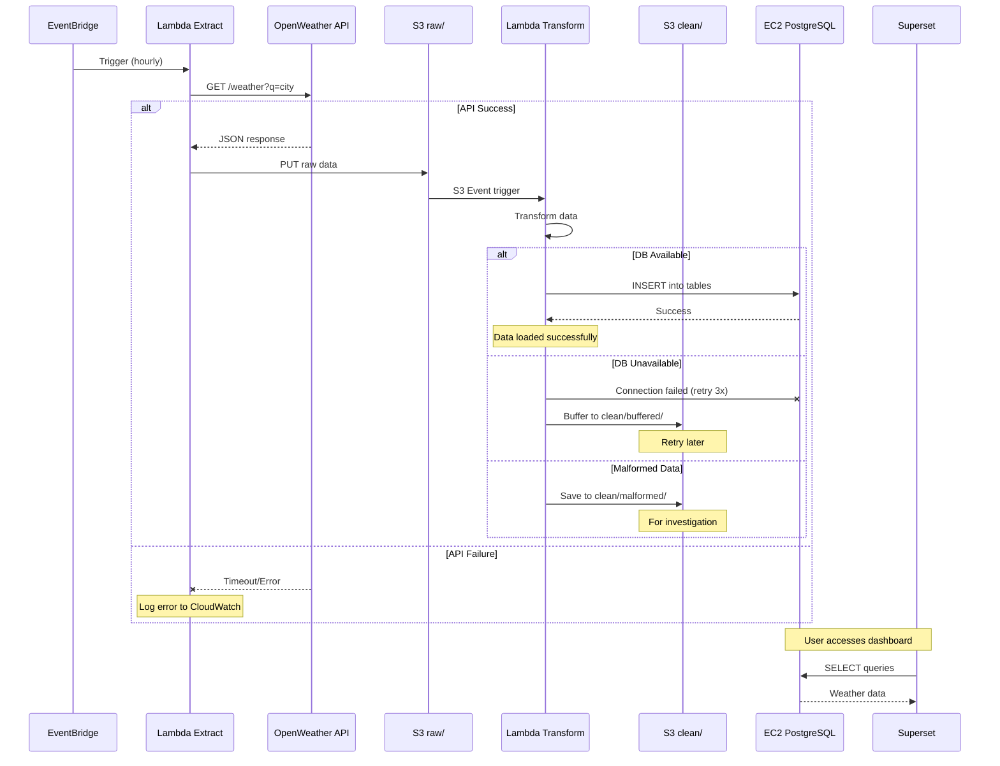
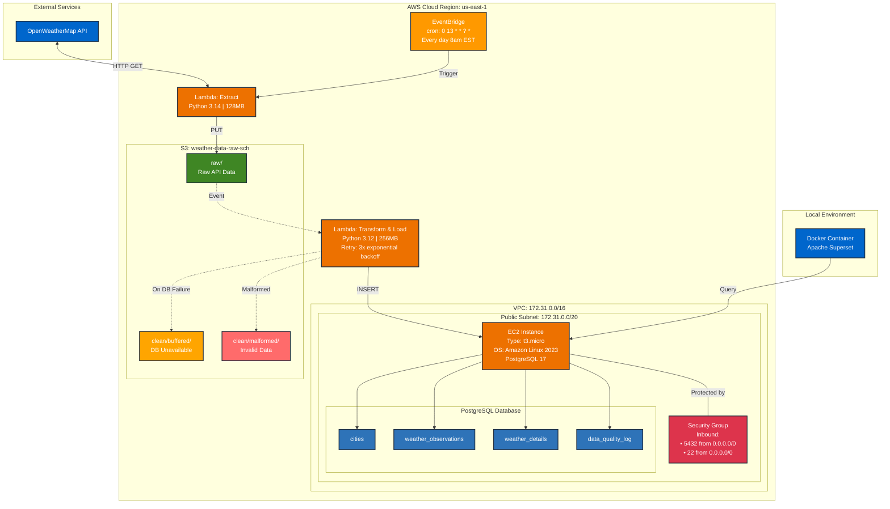
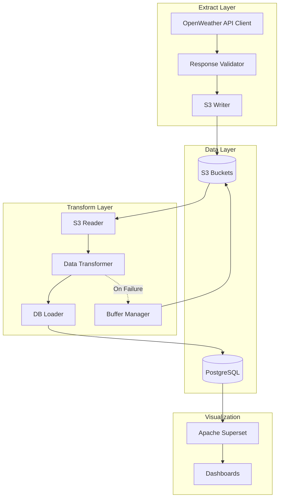
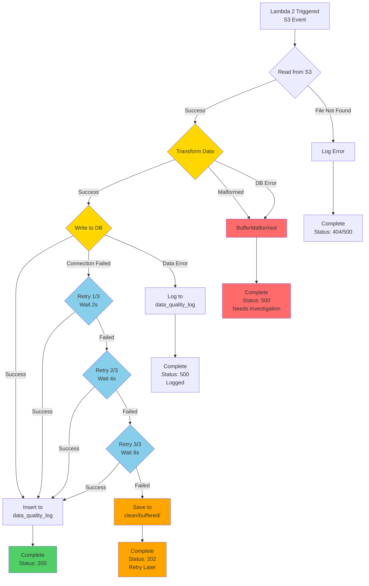
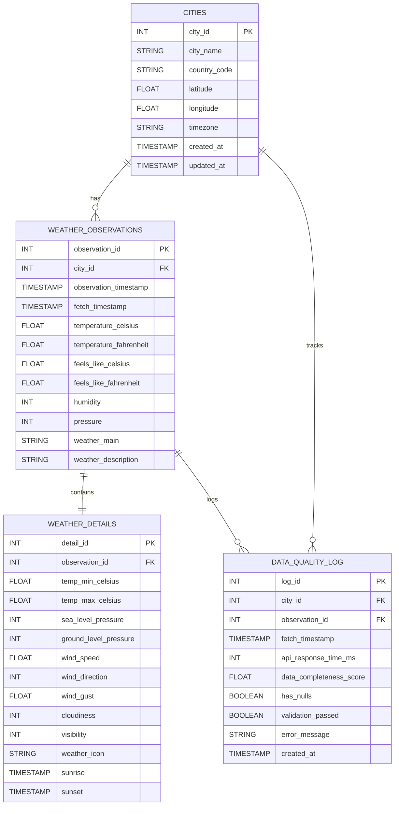

# WeatherETL

---
## 📋 Table of Contents

* [Purpose](#purpose)
* [Features](#features)
* [Project Metrics](#project-metrics)
* [Technology Stack & Rationale](#technology-stack-&-rational)
* [Complete List of Tools & Services](#tools)
* [Technical Diagrams](#technical-diagrams)
   * [Sequence Diagram](#sequence-diagram)
   * [AWS Architecture Diagram](#architecture)
   * [Component Diagram](#component)
   * [Exception Flow Diagram](#exception)
   * [ERD Diagram](#erd)
* [Database Schema](#schema)
* [Implementation Challenges & Solutions](#challenges)
* [Cost Analysis](#cost)
* [Setup Guide](#setup)
* [Troubleshooting](#troubleshooting)
* [Contact](#contact)
---
## Purpose
This project demonstrates the design and implementation of a **production-grade, cloud-based ETL (Extract, Transform, Load) pipeline** for automated weather data collection and visualization. Built entirely on AWS infrastructure, it showcases modern data engineering practices including serverless computing, error handling, cost optimization, and interactive data visualization.

---
## Features
- **Automated Data Collection:** Hourly weather data ingestion from OpenWeatherMap API across 5 cities
- **Robust Error Handling:** 3-tier retry logic with exponential backoff and S3 buffering for failed database connections
- **Real-Time Visualization:** Interactive Superset dashboards with city filtering, trend analysis, and cross-chart interactivity
- **Data Quality Monitoring:** Automated logging of API response times, data completeness scores, and validation status
- **Scalable Architecture:** Serverless ETL pipeline supporting multiple cities and extensible to additional data sources
- **Comprehensive Error Tracking:** Separate storage paths for buffered retries and malformed data investigation
- **Multi-Table Schema:** Normalized database design with cities, observations, details, and quality logs
---
## Project Metrics

| Metric | Value |
|--------|-------|
| **Cities Monitored** | 5 (London, Paris, Tokyo, New York, Sydney) |
| **Data Points Collected** | 120+ per day (24 collections × 5 cities) |
| **Monthly Cost** | Less than $10.00 a month |
| **Data Retention** | 30 days (S3 raw), Unlimited (PostgreSQL) |
| **Dashboard Refresh** | Real-time with interactive filtering |
--- 

## Technology Stack & Rationale

| Technology | Purpose | Why This Choice |
|------------|---------|-----------------|
| **AWS Lambda** | Serverless ETL execution | Pay-per-use pricing, automatic scaling, no server management overhead |
| **AWS EventBridge** | Scheduled triggers | Native AWS cron scheduling, reliable event-driven architecture |
| **Amazon S3** | Raw data storage & buffering | Cost-effective object storage, event notifications |
| **EC2 + PostgreSQL** | Database hosting | full control over configuration |
| **Apache Superset** | Data visualization | Open-source BI tool, SQL-native, supports complex dashboards and filtering |
| **Docker** | Container runtime | Consistent development environment, simplified Superset deployment |
| **Python 3.12+** | ETL scripting | native AWS Lambda support, readable syntax |
| **pg8000** | PostgreSQL driver | Pure Python implementation, Lambda-compatible (must be incorperated as a layer), no C dependencies |
| **Mermaid** | Documentation diagrams | Version-controlled diagrams, renders in GitHub, easy to update |

---
## Complete List of Tools & Services

### AWS Services
- **AWS Lambda** - Serverless compute for Extract and Transform/Load functions
- **AWS EventBridge** - Cron-based scheduling for hourly data collection
- **Amazon S3** - Object storage for raw data, buffered retries, and malformed data
- **Amazon EC2** - Virtual server hosting PostgreSQL database (t3.micro instance)
- **Amazon EBS** - Block storage for EC2 instance (20 GB gp3)
- **AWS VPC** - Virtual Private Cloud for network isolation
- **Security Groups** - Firewall rules for EC2 instance (ports 5432, 22)
- **Elastic IP** - Static IP address for EC2 instance
- **CloudWatch Logs** - Centralized logging for Lambda functions
---
## Technical Diagrams

### Sequence Diagram


### AWS Architecture Diagram

### Component Diagram


### Exception flow diagram


### ERD Diagram

---
## Database Schema

### Create the Database
```sql
CREATE DATABASE weatherETL;
```
### CITIES
```sql

CREATE TABLE CITIES (
    city_id INT AUTO_INCREMENT PRIMARY KEY,
    city_name VARCHAR(255) NOT NULL,
    country_code CHAR(2) NOT NULL,
    latitude FLOAT NOT NULL,
    longitude FLOAT NOT NULL,
    timezone VARCHAR(100) NOT NULL,
    created_at TIMESTAMP DEFAULT CURRENT_TIMESTAMP,
    updated_at TIMESTAMP DEFAULT CURRENT_TIMESTAMP ON UPDATE CURRENT_TIMESTAMP
);
```
### WEATHER_OBSERVATIONS
```SQL

CREATE TABLE WEATHER_OBSERVATIONS (
    observation_id INT AUTO_INCREMENT PRIMARY KEY,
    city_id INT NOT NULL,
    observation_timestamp TIMESTAMP NOT NULL,
    fetch_timestamp TIMESTAMP NOT NULL,
    temperature_celsius FLOAT,
    temperature_fahrenheit FLOAT,
    feels_like_celsius FLOAT,
    feels_like_fahrenheit FLOAT,
    humidity INT,
    pressure INT,
    weather_main VARCHAR(100),
    weather_description VARCHAR(255),
    
    CONSTRAINT fk_weather_city
        FOREIGN KEY (city_id) REFERENCES CITIES(city_id)
        ON DELETE CASCADE
);
```
### WEATHER_DETAILS
```sql
CREATE TABLE WEATHER_DETAILS (
    detail_id INT AUTO_INCREMENT PRIMARY KEY,
    observation_id INT NOT NULL,
    temp_min_celsius FLOAT,
    temp_max_celsius FLOAT,
    sea_level_pressure INT,
    ground_level_pressure INT,
    wind_speed FLOAT,
    wind_direction INT,
    wind_gust FLOAT,
    cloudiness INT,
    visibility INT,
    weather_icon VARCHAR(10),
    sunrise TIMESTAMP NULL,
    sunset TIMESTAMP NULL,

    CONSTRAINT fk_details_observation
        FOREIGN KEY (observation_id) REFERENCES WEATHER_OBSERVATIONS(observation_id)
        ON DELETE CASCADE
);
```
## DATA_QUALITY_LOG
```sql

CREATE TABLE DATA_QUALITY_LOG (
    log_id INT AUTO_INCREMENT PRIMARY KEY,
    city_id INT NOT NULL,
    observation_id INT NOT NULL,
    fetch_timestamp TIMESTAMP NOT NULL,
    api_response_time_ms INT,
    data_completeness_score FLOAT,
    has_nulls BOOLEAN,
    validation_passed BOOLEAN,
    error_message VARCHAR(500),
    created_at TIMESTAMP DEFAULT CURRENT_TIMESTAMP,

    CONSTRAINT fk_log_city
        FOREIGN KEY (city_id) REFERENCES CITIES(city_id)
        ON DELETE SET NULL,

    CONSTRAINT fk_log_observation
        FOREIGN KEY (observation_id) REFERENCES WEATHER_OBSERVATIONS(observation_id)
        ON DELETE SET NULL
);
```
---
## Setup Guide

> **⚠️ Important Disclaimers:**
> 
> This guide covers **only the essential steps** to get the core pipeline running. The following are **NOT included** but are recommended for production use:
> - Detailed security hardening (use strong passwords, restrict security groups to specific IPs)
> - Automated backup configuration for PostgreSQL
> - CloudWatch alarms and monitoring setup
> - IAM role best practices and least-privilege access
> - VPC configuration beyond default settings
> - CI/CD pipeline setup
> - Comprehensive error handling testing
> 
> **Time Estimate:** 2-3 hours for first-time setup

---

### Prerequisites

**Required:**
- AWS Account with administrator access
- OpenWeatherMap API key (free tier: [https://openweathermap.org/api](https://openweathermap.org/api))
- SSH client (PuTTY for Windows, built-in for Mac/Linux)
- PostgreSQL client tools (`psql`) installed locally
- Docker Desktop installed (for Superset)
- Basic familiarity with AWS Console, SSH, and SQL

**Costs:**
- Estimated $10-12/month (within AWS Free Tier limits for first 12 months)

---

### Phase 1: EC2 PostgreSQL Database Setup

#### 1.1 Launch EC2 Instance

1. **AWS Console → EC2 → Launch Instance**

2. **Configure:**
   - **Name:** `WeatherETL-PostgreSQL`
   - **AMI:** Amazon Linux 2023
   - **Instance type:** t3.micro
   - **Key pair:** Create new → Name: `weatheretl-key` → Download `.pem` file (**Save this securely!**)

3. **Network Settings:**
   - **VPC:** Default VPC
   - **Auto-assign Public IP:** Enable
   - **Security Group:** Create new → Name: `WeatherETL-PostgreSQL-SG`
   
   **Configure Security Group Rules:**
   
   **Inbound Rules (allow incoming traffic):**
   
   | Type | Protocol | Port | Source | Description |
   |------|----------|------|--------|-------------|
   | SSH | TCP | 22 | 0.0.0.0/0 | SSH access for management |
   | PostgreSQL | TCP | 5432 | 0.0.0.0/0 | Database access from Lambda |
   | PostgreSQL (IPv6) | TCP | 5432 | ::/0 | IPv6 support (optional) |
   
   **Outbound Rules (allow outgoing traffic):**
   
   | Type | Protocol | Port | Destination | Description |
   |------|----------|------|-------------|-------------|
   | All traffic | All | All | 0.0.0.0/0 | Default - allows updates/installs |
   
   > **📄 Reference Configuration:** See [`/docs/security-group-template.csv`](./docs/security-group-template.csv) for complete security group setup.
   >
   > **⚠️ Security Note:** This configuration allows access from any IP address (0.0.0.0/0). While necessary for Lambda access, consider these security improvements:
   > - Restrict SSH (port 22) to your specific IP address after setup
   > - Use AWS Systems Manager Session Manager instead of SSH for enhanced security
   > - Implement database password rotation using AWS Secrets Manager
   > - Enable VPC Flow Logs for network monitoring

4. **Storage:** 20 GB gp3

5. **Launch Instance**

6. **Note the Public IPv4 address** (e.g., 52.5.21.41)

---

#### 1.2 Install PostgreSQL on EC2

**Connect to EC2:**
**Prerequisites:**
- Download PuTTY: [https://www.putty.org/](https://www.putty.org/)
- Download PuTTYgen (included with PuTTY installer)

**Step 1: Convert .pem key to .ppk format**

1. **Open PuTTYgen** (Start → PuTTY → PuTTYgen)

2. **Load your .pem key:**
   - Click **"Load"**
   - Change file filter to **"All Files (*.*)"** (bottom right)
   - Select your `weatheretl-key.pem` file
   - Click **"Open"**
   - You'll see: "Successfully imported foreign key"
   - Click **"OK"**
   - Make sure you have RSA selected under parameters

3. **Save as .ppk:**
   - Click **"Save private key"**
   - Warning about passphrase → Click **"Yes"** (no passphrase needed for this tutorial)
   - Save as: `weatheretl-key.ppk`
   - **Keep this file secure!**

**Step 2: Connect with PuTTY**

1. **Open PuTTY**

2. **Configure Session:**
   - **Host Name:** `ec2-user@YOUR_EC2_IP` (replace YOUR_EC2_IP with your actual IP)
   - **Port:** `22`
   - **Connection type:** SSH

3. **Load your private key:**
   - Left sidebar: **Connection** → **SSH** → **Auth** → **Credentials**
   - **Private key file for authentication:** Click **"Browse"**
   - Select your `weatheretl-key.ppk` file

4. **Save session (optional but recommended):**
   - Go back to **Session** (top of left sidebar)
   - **Saved Sessions:** Type `WeatherETL-EC2`
   - Click **"Save"**
   - (Next time, just double-click to connect!)

5. **Connect:**
   - Click **"Open"**
   - **Security Alert:** "The server's host key is not cached" → Click **"Accept"**
   - psql -h YOUR_EC2_IP -U postgres -d weatheretl
   - You should now be connected to your EC2 instance!
```

**Install PostgreSQL:**
```bash
# Update system
sudo yum update -y

# Install PostgreSQL 17
sudo yum install postgresql17 postgresql17-server -y

# Initialize database
sudo postgresql-setup --initdb

# Start PostgreSQL
sudo systemctl start postgresql
sudo systemctl enable postgresql
```

**Configure PostgreSQL for remote access:**
```bash
# Edit postgresql.conf
sudo nano /var/lib/pgsql/data/postgresql.conf

# Find and change this line (around line 59):
# FROM: #listen_addresses = 'localhost'
# TO:   listen_addresses = '*'

# Save: Ctrl+X, Y, Enter

# Edit pg_hba.conf
sudo nano /var/lib/pgsql/data/pg_hba.conf

# Add this line at the bottom:
host    all             all             0.0.0.0/0               md5

# Save: Ctrl+X, Y, Enter

# Restart PostgreSQL
sudo systemctl restart postgresql
```

**Create database and user:**
```bash
# Switch to postgres user
sudo -u postgres psql

# Run these commands in psql:
CREATE DATABASE weatheretl;
CREATE USER postgres WITH PASSWORD 'YourSecurePassword123!';
GRANT ALL PRIVILEGES ON DATABASE weatheretl TO postgres;
\q

# Exit back to ec2-user
exit
```

> **⚠️ Security Note:** Replace `YourSecurePassword123!` with a strong password. Store it securely—you'll need it for Lambda and Superset.

---

#### 1.3 Create Database Schema

**From your local machine:**
```bash
# Connect to EC2 PostgreSQL
psql -h YOUR_EC2_IP -U postgres -d weatheretl

# Paste and run this schema:
```
```sql
-- Cities table
CREATE TABLE cities (
    city_id SERIAL PRIMARY KEY,
    city_name VARCHAR(100) UNIQUE NOT NULL,
    country_code VARCHAR(10),
    latitude DECIMAL(9,6),
    longitude DECIMAL(9,6),
    timezone VARCHAR(50),
    created_at TIMESTAMP DEFAULT NOW(),
    updated_at TIMESTAMP DEFAULT NOW()
);

-- Weather observations table
CREATE TABLE weather_observations (
    observation_id SERIAL PRIMARY KEY,
    city_id INT REFERENCES cities(city_id),
    observation_timestamp TIMESTAMP NOT NULL,
    fetch_timestamp TIMESTAMP DEFAULT NOW(),
    temperature_celsius DECIMAL(5,2),
    temperature_fahrenheit DECIMAL(5,2),
    feels_like_celsius DECIMAL(5,2),
    feels_like_fahrenheit DECIMAL(5,2),
    humidity INT,
    pressure INT,
    weather_main VARCHAR(50),
    weather_description VARCHAR(200),
    UNIQUE(city_id, observation_timestamp)
);

-- Weather details table
CREATE TABLE weather_details (
    detail_id SERIAL PRIMARY KEY,
    observation_id INT REFERENCES weather_observations(observation_id),
    temp_min_celsius DECIMAL(5,2),
    temp_max_celsius DECIMAL(5,2),
    sea_level_pressure INT,
    ground_level_pressure INT,
    wind_speed DECIMAL(5,2),
    wind_direction INT,
    wind_gust DECIMAL(5,2),
    cloudiness INT,
    visibility INT,
    weather_icon VARCHAR(10),
    sunrise TIMESTAMP,
    sunset TIMESTAMP
);

-- Data quality log table
CREATE TABLE data_quality_log (
    log_id SERIAL PRIMARY KEY,
    city_id INT REFERENCES cities(city_id),
    observation_id INT REFERENCES weather_observations(observation_id),
    fetch_timestamp TIMESTAMP DEFAULT NOW(),
    api_response_time_ms INT,
    data_completeness_score DECIMAL(3,2),
    has_nulls BOOLEAN,
    validation_passed BOOLEAN,
    error_message TEXT,
    created_at TIMESTAMP DEFAULT NOW()
);

-- Exit
\q
```

---

### Phase 2: S3 Bucket Setup

1. **AWS Console → S3 → Create bucket**

2. **Configure:**
   - **Name:** `weather-data-raw-sch` (must be globally unique—add your initials if taken)
   - **Region:** us-east-1
   - **Block all public access:** Enabled (keep default)
   - **Create bucket**

3. **Create folders:**
   - Click into bucket → Create folder → Name: `raw`
   - Create folder → Name: `clean`

> **Note:** `buffered` and `malformed` subfolders in `clean/` will be created automatically by Lambda.

---

### Phase 3: Lambda Functions

> **⚠️ Prerequisite:** You'll need your Lambda function code from the repository:
> - `extract/extract_function.zip` (includes all dependencies)
> - `transform_load/transform_function.zip` (function code only)
> - `transform_load/pg8000_layer.zip` (PostgreSQL driver dependency layer)

---

#### 3.1 Create Lambda Execution Role

1. **IAM Console → Roles → Create role**

2. **Trusted entity:** AWS service → Lambda

3. **Permissions:** Attach these policies:
   - `AWSLambdaBasicExecutionRole`
   - `AmazonS3FullAccess`

4. **Role name:** `WeatherETL-Lambda-Role`

5. **Create role**

---

#### 3.2 Create Lambda Layer for pg8000

> **📝 Note:** Lambda Layers allow you to separate dependencies from your function code, making deployments smaller and easier to manage.

1. **Lambda Console → Layers → Create layer**

2. **Configure:**
   - **Name:** `pg8000-layer`
   - **Description:** `PostgreSQL database driver (pg8000) for Python 3.11`
   - **Upload:** Click "Upload a .zip file"
   - **Select file:** `pg8000_layer.zip`
   - **Compatible runtimes:** Python 3.11
   - **Create**

3. **Note the Layer ARN** (you'll need this in step 3.4)
   - Example: `arn:aws:lambda:us-east-1:123456789012:layer:pg8000-layer:1`

---

#### 3.3 Lambda 1: Extract Function

1. **AWS Console → Lambda → Create function**

2. **Configure:**
   - **Name:** `WeatherETL-Extract`
   - **Runtime:** Python 3.14
   - **Execution role:** Use existing → `WeatherETL-Lambda-Role`
   - **Create function**

3. **Upload code:**
   - **Code** → **Upload from** → **.zip file**
   - **Select file:** `extract_function.zip`
   - **Save**
   
   > **💡 Tip:** This ZIP includes all dependencies (requests, boto3) bundled with the function code.

4. **Environment variables:**
   - **Configuration** → **Environment variables** → **Edit** → **Add environment variable**
```
   OPENWEATHER_API_KEY = your_api_key_here
   S3_BUCKET = weather-data-raw-sch
   CITIES = London,Paris,Tokyo,New York,Sydney
```
   - **Save**

5. **Configuration:**
   - **Configuration** → **General configuration** → **Edit**
   - **Timeout:** 30 seconds
   - **Memory:** 128 MB
   - **Save**

6. **Verify deployment:**
   - **Code** tab → **Code source** should show your files
   - Check for `lambda_function.py`

---

#### 3.4 Lambda 2: Transform & Load Function

1. **Lambda → Create function**

2. **Configure:**
   - **Name:** `WeatherETL-TransformLoad`
   - **Runtime:** Python 3.12
   - **Execution role:** Use existing → `WeatherETL-Lambda-Role`
   - **Create function**

3. **Upload function code:**
   - **Code** → **Upload from** → **.zip file**
   - **Select file:** `transform_function.zip`
   - **Save**
   
   > **💡 Tip:** This ZIP contains only your function code, not the pg8000 dependency (that's in the Layer).

4. **Attach Lambda Layer:**
   - Scroll down to **Layers** section (bottom of page)
   - **Add a layer**
   - **Choose a layer:**
     - Select **Custom layers**
     - **Custom layers:** pg8000-layer
     - **Version:** 1 (or latest)
   - **Add**
   
   > **✅ Verification:** You should now see "Layers (1)" with pg8000-layer listed

5. **Environment variables:**
   - **Configuration** → **Environment variables** → **Edit**
```
   DB_HOST = YOUR_EC2_IP
   DB_NAME = weatheretl
   DB_USER = postgres
   DB_PASSWORD = YourSecurePassword123!
   DB_PORT = 5432
   S3_BUCKET = weather-data-raw-sch
```
   - **Replace YOUR_EC2_IP** with your actual EC2 public IP address
   - **Save**

6. **Configuration:**
   - **Configuration** → **General configuration** → **Edit**
   - **Timeout:** 60 seconds
   - **Memory:** 256 MB
   - **Save**

7. **Add S3 trigger:**
   - **Configuration** → **Triggers** → **Add trigger**
   - **Select a source:** S3
   - **Bucket:** weather-data-raw-sch
   - **Event type:** All object create events
   - **Prefix:** `raw/`
   - **Suffix:** (leave empty)
   - **Acknowledge:** Check the recursive invocation warning
   - **Add**
   
   > **⚠️ Important:** Make sure prefix is exactly `raw/` with the trailing slash

8. **Verify configuration:**
   - **Configuration** → **Triggers** should show S3 trigger
   - **Layers** should show pg8000-layer
   - **Environment variables** should show all 6 variables

---

#### 3.5 Test Both Lambda Functions

**Test Extract Function:**

1. **Go to WeatherETL-Extract function**

2. **Test tab → Create new test event**
   - **Event name:** `TestEvent`
   - **Event JSON:** (use default - extract doesn't need input)
```json
   {}
```
   - **Save**

3. **Test** → Wait for execution

4. **Check results:**
   - ✅ **Status:** Succeeded
   - ✅ **Response:** Should show success message
   - ✅ **Logs:** Check for "Successfully uploaded to S3"

5. **Verify in S3:**
   - Go to S3 bucket `weather-data-raw-sch/raw/`
   - Should see JSON files for each city

**Test Transform Function:**

1. **Manually trigger it:**
   - Upload a test file to `s3://weather-data-raw-sch/raw/test.json`
   - OR wait for Extract to run and create files

2. **Check CloudWatch Logs:**
   - **Monitor** → **Logs** → **View logs in CloudWatch**
   - Look for latest log stream
   - Should see:
```
     ✓ Successfully read raw JSON from S3
     ✓ Transformed data for city: [CityName]
     ✓ Successfully loaded data for [CityName] into database
```

3. **Verify in database:**
```bash
   # From your local machine
   psql -h YOUR_EC2_IP -U postgres -d weatheretl
   
   SELECT COUNT(*) FROM cities;
   SELECT COUNT(*) FROM weather_observations;
   SELECT * FROM cities;
   
   \q
```

**Common Issues:**

| Issue | Solution |
|-------|----------|
| **"Unable to import module 'lambda_function'"** | Check that ZIP file has `lambda_function.py` at root level, not in a subfolder |
| **"No module named 'pg8000'"** | Verify pg8000-layer is attached to Transform function |
| **"Connection refused to database"** | Check EC2 security group allows port 5432, verify DB_HOST is correct |
| **"Access Denied" to S3** | Verify Lambda execution role has `AmazonS3FullAccess` policy |
| **Transform function not triggering** | Check S3 trigger prefix is `raw/` (with trailing slash) |

---
### Phase 4: EventBridge Scheduling

1. **EventBridge Console → Rules → Create rule**

2. **Configure:**
   - **Name:** `WeatherETL-HourlyTrigger`
   - **Rule type:** Schedule
   - **Schedule pattern:** Cron expression
   - **Cron:** `0 13 * * ? *` (8am EST daily)

3. **Target:**
   - **Target type:** AWS service → Lambda function
   - **Function:** WeatherETL-Extract

4. **Create rule**

---

### Phase 5: Superset Dashboard

#### 5.1 Install Superset with Docker

**Clone Superset repository:**
```bash
git clone https://github.com/apache/superset.git
cd superset
```

**Start Superset:**
```bash
docker compose -f docker-compose-non-dev.yml up -d
```

**Wait ~2 minutes for initialization**

---

#### 5.2 Access and Configure

1. **Open browser:** http://localhost:8088

2. **Login:**
   - Username: `admin`
   - Password: `admin`

3. **Add database connection:**
   - Settings → Database Connections → + Database
   - **Select:** PostgreSQL
   - **Connection:**
     - Host: `YOUR_EC2_IP`
     - Port: `5432`
     - Database: `weatheretl`
     - Username: `postgres`
     - Password: `YourSecurePassword123!`
   - **Test Connection** → **Connect**

4. **Build dashboards** (see screenshots for examples)
   - Use the publicly accessable dashboard for this project
     - WeatherETL Dashboard

---

### Phase 6: Testing

#### 6.1 Test Lambda Extract

1. **Lambda Console → WeatherETL-Extract**
2. **Test tab → Create test event**
3. **Test** → Check logs for success
4. **Verify in S3:** Check `weather-data-raw-sch/raw/` for JSON files

#### 6.2 Test Transform & Load

1. Should trigger automatically from S3 event
2. **Check CloudWatch Logs**
3. **Verify in database:**
```sql
   psql -h YOUR_EC2_IP -U postgres -d weatheretl
   SELECT * FROM cities;
   SELECT COUNT(*) FROM weather_observations;
   \q
```

#### 6.3 Wait for Scheduled Run

- EventBridge will trigger at 1:00 PM UTC (8:00 AM EST) daily
- Or manually invoke Lambda to test immediately

---

### Phase 7: Verify Everything Works

**Checklist:**
- [ ] EC2 instance running with PostgreSQL accessible
- [ ] S3 bucket created with `raw/` and `clean/` folders
- [ ] Lambda Extract function uploads to S3
- [ ] Lambda Transform loads data to database
- [ ] EventBridge triggers Lambda on schedule
- [ ] Superset connects to database and displays data

---

---


