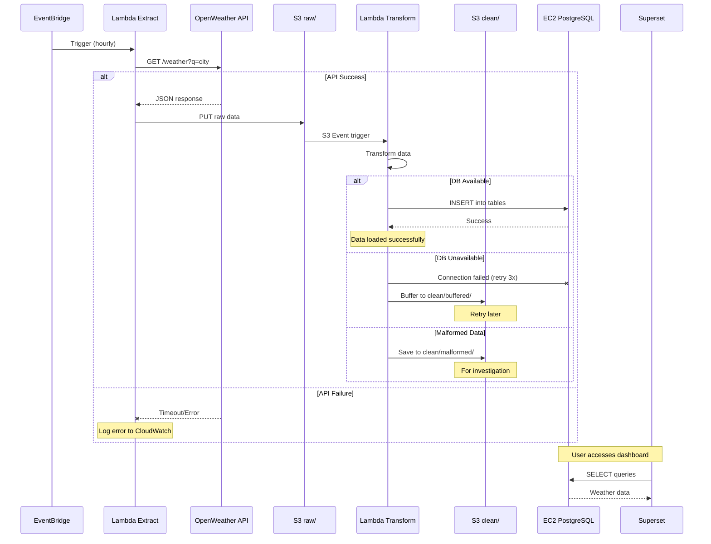
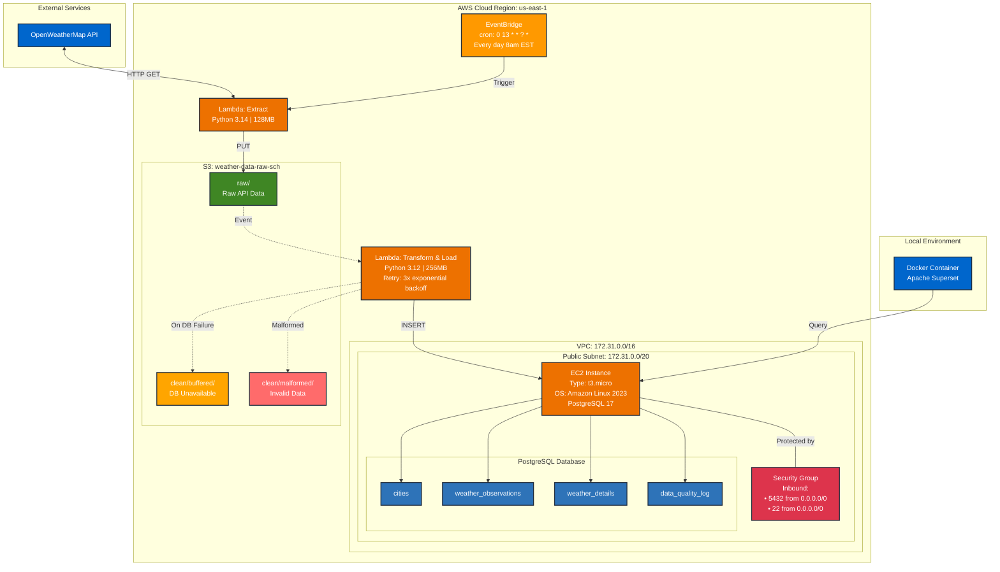
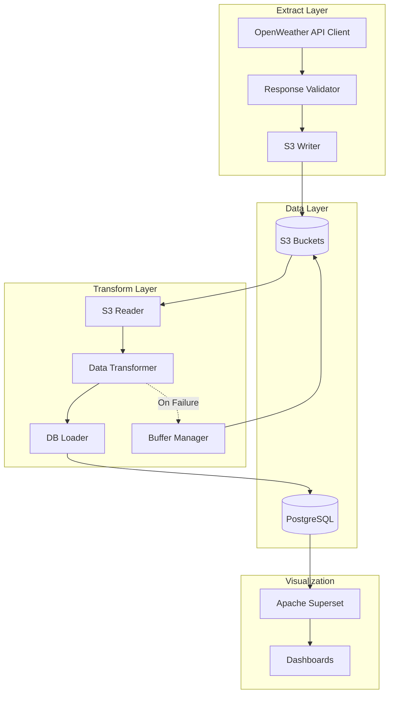
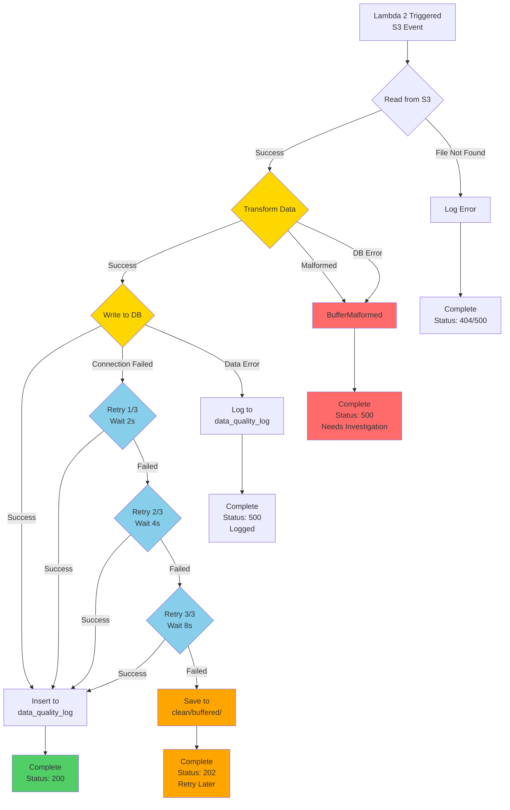
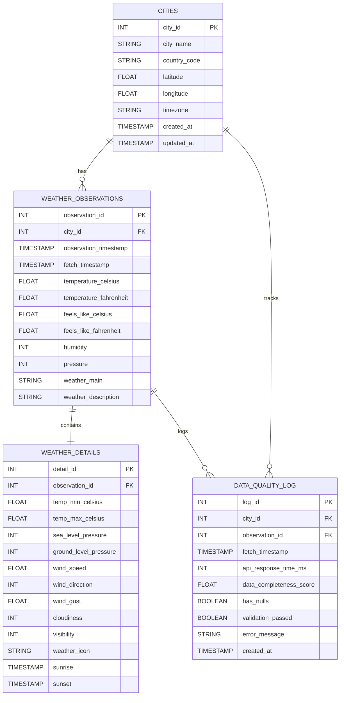

# WeatherETL

---
## 📋 Table of Contents

* [Purpose](#purpose)
* [Features](#features)
* [Project Metrics](#project-metrics)
* [Technology Stack & Rationale](#technology-stack)
* [Complete List of Tools & Services](#tools)
* [Technical Diagrams](#diagrams)
   * [Sequence Diagram](#sequence)
   * [AWS Architecture Diagram](#architecture)
   * [Component Diagram](#component)
   * [Exception Flow Diagram](#exception)
   * [ERD Diagram](#erd)
* [Database Schema](#schema)
* [Implementation Challenges & Solutions](#challenges)
* [Cost Analysis](#cost)
* [Setup Guide](#setup)
* [Troubleshooting](#troubleshooting)
* [Contact](#contact)
---
## Purpose
This project demonstrates the design and implementation of a **production-grade, cloud-based ETL (Extract, Transform, Load) pipeline** for automated weather data collection and visualization. Built entirely on AWS infrastructure, it showcases modern data engineering practices including serverless computing, error handling, cost optimization, and interactive data visualization.

---
## Features
- **Automated Data Collection:** Hourly weather data ingestion from OpenWeatherMap API across 5 cities
- **Robust Error Handling:** 3-tier retry logic with exponential backoff and S3 buffering for failed database connections
- **Real-Time Visualization:** Interactive Superset dashboards with city filtering, trend analysis, and cross-chart interactivity
- **Data Quality Monitoring:** Automated logging of API response times, data completeness scores, and validation status
- **Scalable Architecture:** Serverless ETL pipeline supporting multiple cities and extensible to additional data sources
- **Comprehensive Error Tracking:** Separate storage paths for buffered retries and malformed data investigation
- **Multi-Table Schema:** Normalized database design with cities, observations, details, and quality logs
---
## Project Metrics

| Metric | Value |
|--------|-------|
| **Cities Monitored** | 5 (London, Paris, Tokyo, New York, Sydney) |
| **Data Points Collected** | 120+ per day (24 collections × 5 cities) |
| **Monthly Cost** | Less than $10.00 a month |
| **Data Retention** | 30 days (S3 raw), Unlimited (PostgreSQL) |
| **Dashboard Refresh** | Real-time with interactive filtering |
--- 

## Technology Stack & Rationale

| Technology | Purpose | Why This Choice |
|------------|---------|-----------------|
| **AWS Lambda** | Serverless ETL execution | Pay-per-use pricing, automatic scaling, no server management overhead |
| **AWS EventBridge** | Scheduled triggers | Native AWS cron scheduling, reliable event-driven architecture |
| **Amazon S3** | Raw data storage & buffering | Cost-effective object storage, event notifications |
| **EC2 + PostgreSQL** | Database hosting | full control over configuration |
| **Apache Superset** | Data visualization | Open-source BI tool, SQL-native, supports complex dashboards and filtering |
| **Docker** | Container runtime | Consistent development environment, simplified Superset deployment |
| **Python 3.12+** | ETL scripting | native AWS Lambda support, readable syntax |
| **pg8000** | PostgreSQL driver | Pure Python implementation, Lambda-compatible (must be incorperated as a layer), no C dependencies |
| **Mermaid** | Documentation diagrams | Version-controlled diagrams, renders in GitHub, easy to update |

---
## Complete List of Tools & Services

### AWS Services
- **AWS Lambda** - Serverless compute for Extract and Transform/Load functions
- **AWS EventBridge** - Cron-based scheduling for hourly data collection
- **Amazon S3** - Object storage for raw data, buffered retries, and malformed data
- **Amazon EC2** - Virtual server hosting PostgreSQL database (t3.micro instance)
- **Amazon EBS** - Block storage for EC2 instance (20 GB gp3)
- **AWS VPC** - Virtual Private Cloud for network isolation
- **Security Groups** - Firewall rules for EC2 instance (ports 5432, 22)
- **Elastic IP** - Static IP address for EC2 instance
- **CloudWatch Logs** - Centralized logging for Lambda functions
---
## Technical Diagrams

### Sequence Diagram


### AWS Architecture Diagram

### Component Diagram


### Exception flow diagram


### ERD Diagram

---
## Database Schema

### Create the Database
```sql
CREATE DATABASE weatherETL;
```
### CITIES
```sql

CREATE TABLE CITIES (
    city_id INT AUTO_INCREMENT PRIMARY KEY,
    city_name VARCHAR(255) NOT NULL,
    country_code CHAR(2) NOT NULL,
    latitude FLOAT NOT NULL,
    longitude FLOAT NOT NULL,
    timezone VARCHAR(100) NOT NULL,
    created_at TIMESTAMP DEFAULT CURRENT_TIMESTAMP,
    updated_at TIMESTAMP DEFAULT CURRENT_TIMESTAMP ON UPDATE CURRENT_TIMESTAMP
);
```
### WEATHER_OBSERVATIONS
```SQL

CREATE TABLE WEATHER_OBSERVATIONS (
    observation_id INT AUTO_INCREMENT PRIMARY KEY,
    city_id INT NOT NULL,
    observation_timestamp TIMESTAMP NOT NULL,
    fetch_timestamp TIMESTAMP NOT NULL,
    temperature_celsius FLOAT,
    temperature_fahrenheit FLOAT,
    feels_like_celsius FLOAT,
    feels_like_fahrenheit FLOAT,
    humidity INT,
    pressure INT,
    weather_main VARCHAR(100),
    weather_description VARCHAR(255),
    
    CONSTRAINT fk_weather_city
        FOREIGN KEY (city_id) REFERENCES CITIES(city_id)
        ON DELETE CASCADE
);
```
### WEATHER_DETAILS
```sql
CREATE TABLE WEATHER_DETAILS (
    detail_id INT AUTO_INCREMENT PRIMARY KEY,
    observation_id INT NOT NULL,
    temp_min_celsius FLOAT,
    temp_max_celsius FLOAT,
    sea_level_pressure INT,
    ground_level_pressure INT,
    wind_speed FLOAT,
    wind_direction INT,
    wind_gust FLOAT,
    cloudiness INT,
    visibility INT,
    weather_icon VARCHAR(10),
    sunrise TIMESTAMP NULL,
    sunset TIMESTAMP NULL,

    CONSTRAINT fk_details_observation
        FOREIGN KEY (observation_id) REFERENCES WEATHER_OBSERVATIONS(observation_id)
        ON DELETE CASCADE
);
```
## DATA_QUALITY_LOG
```sql

CREATE TABLE DATA_QUALITY_LOG (
    log_id INT AUTO_INCREMENT PRIMARY KEY,
    city_id INT NOT NULL,
    observation_id INT NOT NULL,
    fetch_timestamp TIMESTAMP NOT NULL,
    api_response_time_ms INT,
    data_completeness_score FLOAT,
    has_nulls BOOLEAN,
    validation_passed BOOLEAN,
    error_message VARCHAR(500),
    created_at TIMESTAMP DEFAULT CURRENT_TIMESTAMP,

    CONSTRAINT fk_log_city
        FOREIGN KEY (city_id) REFERENCES CITIES(city_id)
        ON DELETE SET NULL,

    CONSTRAINT fk_log_observation
        FOREIGN KEY (observation_id) REFERENCES WEATHER_OBSERVATIONS(observation_id)
        ON DELETE SET NULL
);
```
---
## Setup Guide
---


